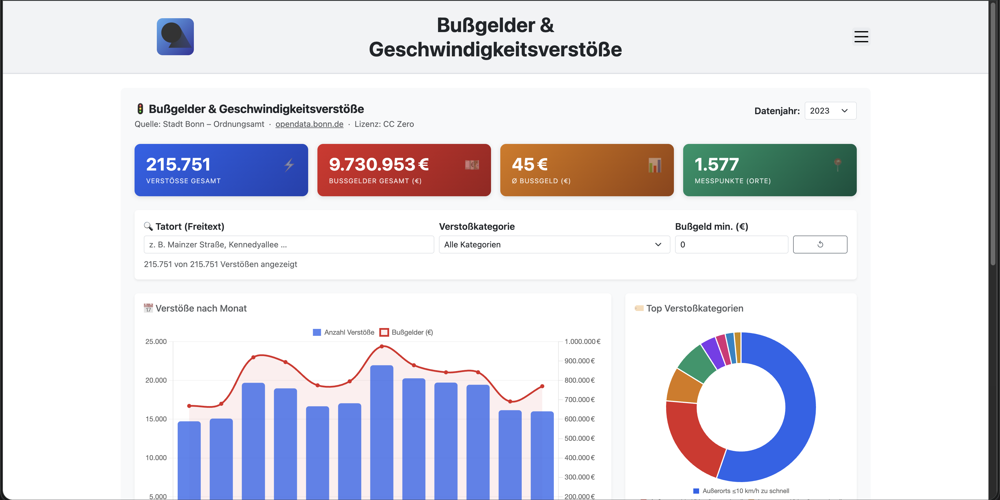
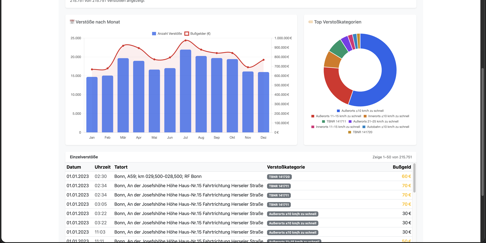

# Bußgelder und Geschwindigkeitsverstöße - App für den Open Data App-Store (ODAS)

Interaktive Visualisierung von Bußgeldern und Geschwindigkeitsverstößen der Stadt Bonn für den [Open Data App Store](https://open-data-app-store.de/). Entspricht der [Open Data App-Spezifikation](https://open-data-apps.github.io/open-data-app-docs/open-data-app-spezifikation/). Mehr unter https://github.com/open-data-apps

---

## Funktionen





Single Page Application mit Logo, Menü, Impressum/Datenschutz/Kontakt-Seiten und Fußzeile. Die Konfiguration wird vom ODAS geladen. Inhalte:

- **Kennzahlen**: Gesamtanzahl Verstöße, Gesamtbußgeldsumme, durchschnittliches Bußgeld, Anzahl Messpunkte
- **Verstöße nach Monat**: Kombiniertes Chart (Balken für Anzahl, Linie für Bußgeldsumme)
- **Top-8 Verstoßkategorien**: Donut-Chart auf Basis TBNR-Codes
- **Filter**: Tatort-Freitext, Verstoßkategorie, Mindest-Bußgeld
- **Datentabelle**: Paginierte Detailansicht (50 Datensätze pro Seite)
- **Jahresumschaltung**: Datensätze 2021, 2022, 2023

---

## Datenformat

Unterstützt **CSV** (Semikolon-separiert, Windows-1252-kodiert).

---

## Kompatible Datensätze

Datensätze zu Geschwindigkeitsverstößen mit folgenden Kernfeldern:

| Schema-Feld         | Beschreibung                     | Beispiel         |
| ------------------- | -------------------------------- | ---------------- |
| `TATTAG`            | Datum des Verstoßes (TT.MM.JJJJ) | `10.05.2023`     |
| `TATZEIT`           | Uhrzeit im HHmm-Format           | `1430`           |
| `TATORT`            | Ort/Straße des Verstoßes        | `Mainzer Straße` |
| `TATBESTANDBE_TBNR` | Verstoßcode (Tatbestandskatalog) | `103205`         |
| `GELDBUSSE`         | Bußgeld in EUR                  | `55`             |

---

## Entwicklung

**Voraussetzungen:** Docker / Docker Compose, Make

```bash
make build up
```

App läuft auf http://localhost:8089 (Konfiguration wird lokal geladen).

### Wichtige Dateien

| Datei                      | Beschreibung                                                                 |
| -------------------------- | ---------------------------------------------------------------------------- |
| `app/app.js`               | Hauptlogik: Datenladen, Aufbereitung, Filterung, Chart.js-Diagramme, Tabelle |
| `app-package.json`         | App-Metadaten und Instanz-Konfigurationsfelder für den ODAS                 |
| `assets/odas-app-icon.svg` | App-Icon                                                                     |
| `odas-config/config.json`  | Lokale Konfiguration für die Entwicklung                                    |
| `docker-compose.yml`       | Lokale Laufzeitumgebung                                                      |

---

## Konfiguration (Instanz)

| Parameter      | Beschreibung                                        | Pflicht |
| -------------- | --------------------------------------------------- | ------- |
| `apiurl`       | Basis-URL des Open-Data-Datensatzes / der Ressource | ja      |
| `urlDaten`     | URL zur Datensatz-Seite im ODP                      | ja      |
| `titel`        | Anzeigetitel der App                                | ja      |
| `seitentitel`  | Browser-Tab-Titel                                   | ja      |
| `kontakt`      | Inhalt der Kontaktseite (Markdown)                  | ja      |
| `beschreibung` | Inhalt der Seite "Über diese App" (Markdown)       | ja      |
| `impressum`    | Inhalt der Impressumsseite (Markdown)               | ja      |
| `datenschutz`  | Inhalt der Datenschutzseite (Markdown)              | ja      |
| `fusszeile`    | Text in der Fußzeile                               | ja      |

---

## Technische Hinweise

- **Proxy für CORS-Workaround**: CSV-Abrufe laufen über den lokalen Endpunkt `/odp-data?path=...` per `POST`.
- **Erwartete Proxy-Response**:

```json
{
  "content": "CSV-Rohdaten als String"
}
```

- **Bibliotheken**:
  - `PapaParse` für CSV-Parsing
  - `Chart.js` für Diagramme
  - `Bootstrap 5` für Layout und Komponenten

---

## Datenquellen (Bonn)

- **2023**: https://opendata.bonn.de/sites/default/files/Geschwindigkeitsverstoesse2023.csv
- **2022**: https://opendata.bonn.de/sites/default/files/Geschwindigkeitsverstoesse2022.csv
- **2021**: https://opendata.bonn.de/sites/default/files/Geschwindigkeitsverst%C3%B6%C3%9Fe%202021.csv

Quelle: [opendata.bonn.de](https://opendata.bonn.de)

---

## Autor

© 2026, Ondics GmbH
