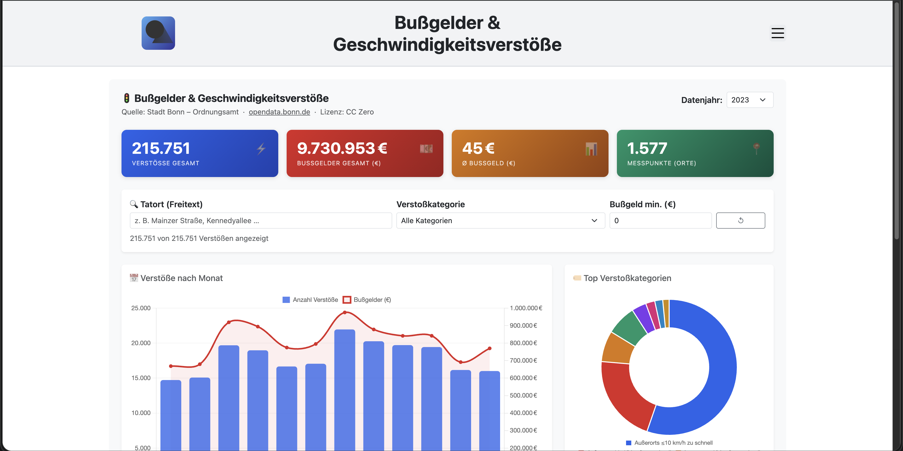
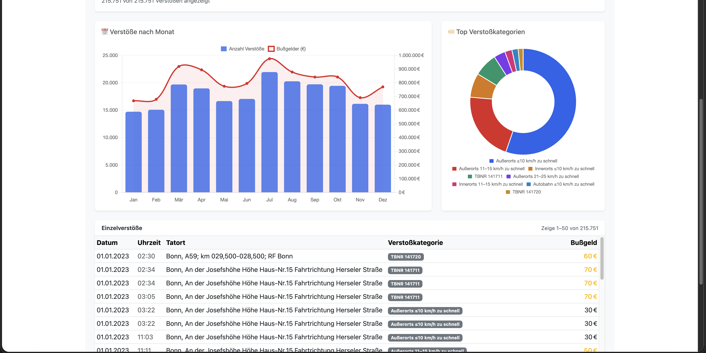

# Bußgelder und Geschwindigkeitsverstöße - App für den Open Data App-Store (ODAS)

Interaktive Visualisierung von Bußgeldern und Geschwindigkeitsverstößen der Stadt Bonn für den [Open Data App Store](https://open-data-app-store.de/). Entspricht der [Open Data App-Spezifikation](https://open-data-apps.github.io/open-data-app-docs/open-data-app-spezifikation/). Mehr unter https://github.com/open-data-apps

---

## Funktionen





Single Page Application mit Logo, Menü, Impressum/Datenschutz/Kontakt-Seiten und Fußzeile. Die Konfiguration wird vom ODAS geladen. Inhalte:

- **Kennzahlen**: Gesamtanzahl Verstöße, Gesamtbußgeldsumme, durchschnittliches Bußgeld, Anzahl Messpunkte
- **Verstöße nach Monat**: Kombiniertes Chart (Balken für Anzahl, Linie für Bußgeldsumme)
- **Top-8 Verstoßkategorien**: Donut-Chart auf Basis TBNR-Codes
- **Filter**: Tatort-Freitext, Verstoßkategorie, Mindest-Bußgeld
- **Datentabelle**: Paginierte Detailansicht (50 Datensätze pro Seite)
- **Jahresumschaltung**: Datensätze 2021, 2022, 2023

---

## Für wen ist diese App?

Diese App analysiert Geschwindigkeitsverstöße und Bußgelder der Stadt Bonn. Sie richtet sich an Journalist:innen, Verkehrsforscher:innen und Bürger:innen, die Transparenz über Tempokontrollen erhalten möchten.

---

## Datenformat

Unterstützt **CSV** (Semikolon-separiert, Windows-1252-kodiert).

---

## Kompatible Datensätze

Datensätze zu Geschwindigkeitsverstößen mit folgenden Kernfeldern:

| Schema-Feld         | Beschreibung                     | Beispiel         |
| ------------------- | -------------------------------- | ---------------- |
| `TATTAG`            | Datum des Verstoßes (TT.MM.JJJJ) | `10.05.2023`     |
| `TATZEIT`           | Uhrzeit im HHmm-Format           | `1430`           |
| `TATORT`            | Ort/Straße des Verstoßes        | `Mainzer Straße` |
| `TATBESTANDBE_TBNR` | Verstoßcode (Tatbestandskatalog) | `103205`         |
| `GELDBUSSE`         | Bußgeld in EUR                  | `55`             |

---

## Entwicklung

**Voraussetzungen:** Docker / Docker Compose, Make

```bash
make build up
```

App läuft auf http://localhost:8089 (Konfiguration wird lokal geladen).

### Wichtige Dateien

| Datei                      | Beschreibung                                                                 |
| -------------------------- | ---------------------------------------------------------------------------- |
| `app/app.js`               | Hauptlogik: Datenladen, Aufbereitung, Filterung, Chart.js-Diagramme, Tabelle |
| `app-package.json`         | App-Metadaten und Instanz-Konfigurationsfelder für den ODAS                 |
| `assets/odas-app-icon.svg` | App-Icon                                                                     |
| `odas-config/config.json`  | Lokale Konfiguration für die Entwicklung                                    |
| `docker-compose.yml`       | Lokale Laufzeitumgebung                                                      |

---

## Konfiguration (Instanz)

| Parameter      | Beschreibung                                        | Pflicht |
| -------------- | --------------------------------------------------- | ------- |
| `csvQuelle2021` | CSV-URL der Geschwindigkeitsverstöße für 2021          | ja      |
| `csvQuelle2022` | CSV-URL der Geschwindigkeitsverstöße für 2022          | ja      |
| `csvQuelle2023` | CSV-URL der Geschwindigkeitsverstöße für 2023          | ja      |
| `urlDaten`     | URL zur Datensatz-Seite im ODP                      | ja      |
| `titel`        | Anzeigetitel der App                                | ja      |
| `seitentitel`  | Browser-Tab-Titel                                   | ja      |
| `kontakt`      | Inhalt der Kontaktseite (Markdown)                  | ja      |
| `beschreibung` | Inhalt der Seite "Über diese App" (Markdown)       | ja      |
| `impressum`    | Inhalt der Impressumsseite (Markdown)               | ja      |
| `datenschutz`  | Inhalt der Datenschutzseite (Markdown)              | ja      |
| `fusszeile`    | Text in der Fußzeile                               | ja      |

---

## Technische Hinweise

- **Proxy für CORS-Workaround**: CSV-Abrufe laufen über den lokalen Endpunkt `/odp-data?path=...` per `POST`.
- **Erwartete Proxy-Response**:

```json
{
  "content": "CSV-Rohdaten als String"
}
```

- **Bibliotheken**:
  - `PapaParse` für CSV-Parsing
  - `Chart.js` für Diagramme
  - `Bootstrap 5` für Layout und Komponenten

---

## Datenquellen (Bonn)

- **2023**: https://opendata.bonn.de/sites/default/files/Geschwindigkeitsverstoesse2023.csv
- **2022**: https://opendata.bonn.de/sites/default/files/Geschwindigkeitsverstoesse2022.csv
- **2021**: https://opendata.bonn.de/sites/default/files/Geschwindigkeitsverst%C3%B6%C3%9Fe%202021.csv

Quelle: [opendata.bonn.de](https://opendata.bonn.de)

---

## Betriebsarten

Die App kann lokal, eigenstaendig hinter einem Traefik-Reverse-Proxy oder ueber den ODAS
betrieben werden.

**Standalone ist eingeschraenkt** und nur mit einer ausgetauschten, CORS-freigegebenen
Datenquelle moeglich — siehe den Hinweis unter „Standalone-Betrieb".

### Datenabruf: `proxyAktiv`

| Wert   | Bedeutung                                                                   |
| ------ | --------------------------------------------------------------------------- |
| `nein` | Direkter Abruf der Daten-URL. Setzt eine CORS-freigegebene Quelle voraus.    |
| `ja`   | Abruf ueber den ODAS-Proxy `…/odp-data`. Nur im ODAS-Live-System verfuegbar. |

**Diese App ist auf `ja` voreingestellt.** Die konfigurierte Datenquelle
(`opendata.bonn.de`) sendet keinen `Access-Control-Allow-Origin`-Header; ein Direktabruf aus
dem Browser wird daher blockiert. Fuer Entwicklung und Standalone-Betrieb muss
eine CORS-freigegebene Datenquelle konfiguriert und `proxyAktiv` auf `nein`
gesetzt werden.

### Standalone-Betrieb

> **Standalone ist bei dieser App eingeschraenkt.** Mit der mitgelieferten Datenquelle
> ist sie in **keiner** Standalone-Konfiguration funktionsfaehig: mit `proxyAktiv: "ja"`
> fehlt der Proxy im Container, mit `"nein"` greift die CORS-Sperre der Quelle. Der
> Standalone-Betrieb setzt deshalb zwingend eine ausgetauschte, CORS-freigegebene
> Datenquelle voraus.

Voraussetzung: ein laufender Traefik mit dem externen Docker-Netzwerk `proxynet`,
dem EntryPoint `websecure` und dem Zertifikatsresolver `letsencrypt`.

1. In `docker-compose.standalone.yml` den Platzhalter `app1.example.com` durch den
   echten FQDN ersetzen.
2. In `odas-config/config.json` `proxyAktiv` auf `nein` **setzen** — ausgeliefert
   wird `ja`. Der ODAS-Proxy `…/odp-data` steht im Standalone-Container nicht zur
   Verfuegung; die mitgelieferte `nginx.conf` kennt keinen entsprechenden
   `location`-Block.
3. Die Datenquelle (`csvQuelle2021`, `csvQuelle2022`, `csvQuelle2023`) auf eine CORS-freigegebene Ressource umstellen. Die
   mitgelieferte Quelle (`opendata.bonn.de`) sendet keinen
   `Access-Control-Allow-Origin`-Header und ist standalone **nicht** nutzbar.
4. Starten:

```bash
STANDALONE=true make up
STANDALONE=true make logs
STANDALONE=true make down
```

Im Standalone-Betrieb entfaellt die lokale Portfreigabe; Traefik terminiert TLS und
leitet auf den internen Nginx-Port 80 weiter. Die Konfiguration wird aus derselben
`odas-config/config.json` gelesen wie in der Entwicklung und von Nginx unter `/config`
ausgeliefert.

### Auslieferung an den ODAS

`make zip` erzeugt das Liefer-ZIP mit `app/`, `assets/`, `app-package.json` und
`CHANGELOG.md`. Die Infrastrukturdateien (`Dockerfile`, `docker-compose*.yml`,
`nginx.conf`, `Makefile`) sind nicht Teil der Auslieferung. Das ZIP ist ein Bauartefakt und wird nicht mitversioniert, sondern bei Bedarf mit `make zip` erzeugt.

## Autor

© 2026, Ondics GmbH
